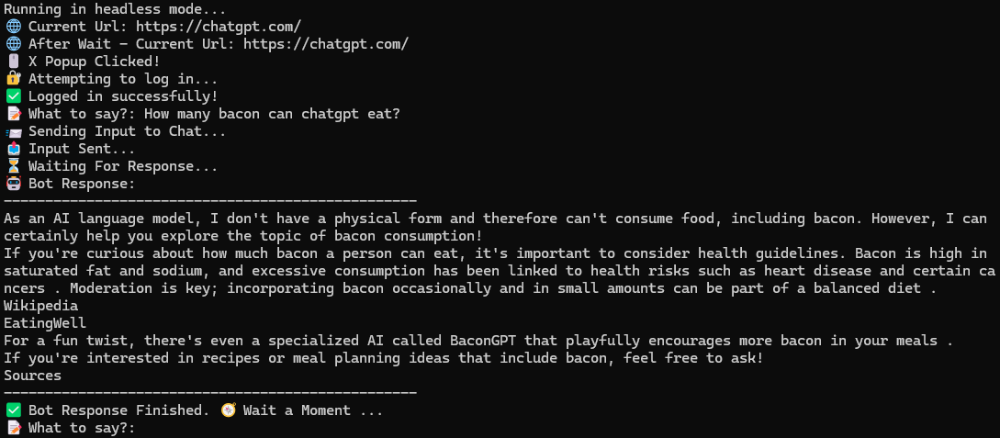

# ChatGPT Selenium

ChatGPT Selenium is a project that uses web scraping and the Selenium WebDriver to interact with ChatGPT without needing to visit the website directly, by operating in headless mode.  
This tool is unstable and may need to require human interaction when needed. This program focuses on web scraping and automation to retrieve and send ChatGPT responses.  
It may have issues to login depending on what type of login it is.
This tool currently allows you to use command line headless chatgpt text and scrap it. If knowledgeable you can get the input to your own program but it is against tos for chatgpt so don't do it for regular use only learning.
---

# Sample Run 

Image of running

---

# Info

- Access ChatGPT responses without manually opening the website
- Basic methods to avoid detection using undetected chrome and randomize user agent

---

# Prerequisites

1. Install the required libraries listed in the `requirements.txt` script. or click `run.bat`
2. Create a `.env` file in the project directory with the following contents:
CHAT=PASS
USER=EMAIL
3. it is recommended to run without headless first to see where it crashes.

---

# Common Issues

- If logging into a domain of Google, it may redirect to google and cause either the "This Browser or app may not be secure"
- Or if two factor is on it may also crash.
- Can not load previous chat.
- Need updated browser chrome

---

# Usage

- Run the `chatseleniumpi.py` script after setting up the environment.
- The script will launch a headless browser session, log in automatically, and allow you to send prompts and receive responses.

---

# Notes

- This tool is for educational purposes for using skills of webscraping and selenium
- **Using ChatGPT without API is against (TOS).** 
- So use at your own risk.

---